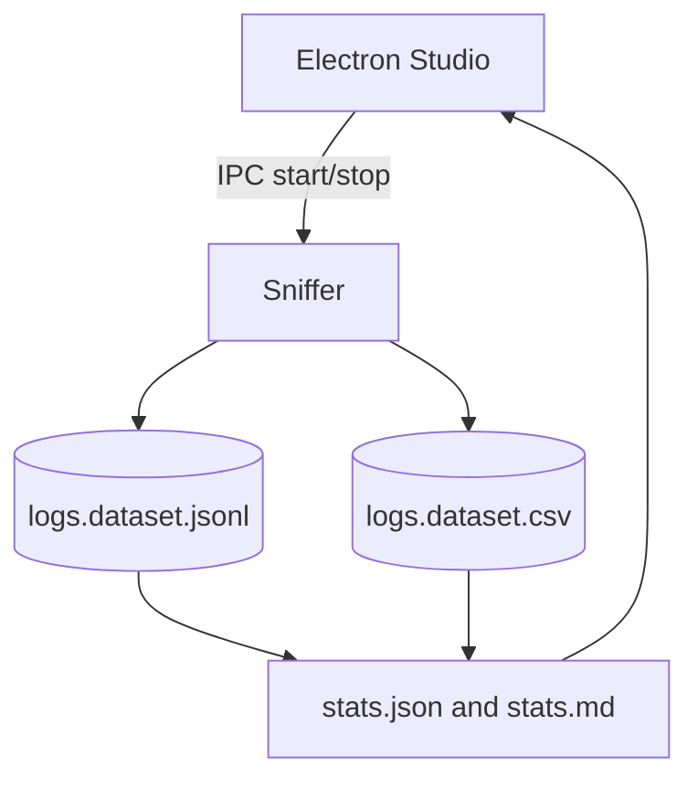
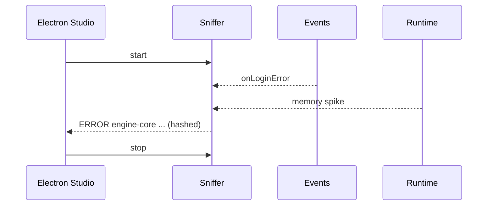

# Chapter 09 - Logging

### Professional Pro Template - Agent-Ready - OTClient v8 (Consolidated with Fix Pack 01)

> Cel: ten rozdzial standaryzuje zbieranie logow aplikacyjnych i zewnetrznych plikow logow. Tworzy rekordy NDJSON i CSV, wylicza statystyki, opisuje polityki prywatnosci (hash wiadomosci) oraz tryby pracy (proxy logger i tail plikow). Styl elastyczny i konkretny. Calosc ASCII-only, UTF-8 bez BOM.

---

### 0) Executive summary

- Co: unifikacja logow z klienta lub plikow zewnetrznych (level, tag, ts, message lub hash), korelacja z runtime i eventami.
- Dla kogo: inzynierowie, QA, narzedzia AI/RAG i Studio (Electron/React).
- Output: NDJSON (pelny), CSV (splaszczony), statystyki (JSON/MD), analizy (findings, correlations), diagramy (Mermaid), narracja (sekcje merytoryczne).
- Agent-ready: mapa plikow, punkty wstrzykniec (AGENT:INSERT), IO setup, CSV header, Studio hooks, checklist DoD.

---

### 1) Struktura folderu i linkowanie

```bash
09_logging/
  README.md                      # narracja + TOC + nawigacja (ten plik)
  meta.json                      # mapa plikow + zadania + tags (machine-readable)
  logs.schema.json               # walidacja rekordow NDJSON (log)
  sections/
    00_logging_basics.md         # podstawy logowania (dla nowych dev)
    01_introduction.md           # po co normalizowac logi
    02_log_model.md              # slownik pol logu + przyklady
    03_collection_methods.md     # tryby: proxy logger i tail plikow
    04_quality_and_limits.md     # jakosc, ograniczenia, SLO
    05_how_to_read_stats.md      # jak czytac statystyki i korelowac
  datasets/
    logs.dataset.jsonl           # NDJSON (append-only)
    logs.dataset.csv             # CSV (naglowek staly)
    chunks/
      README.md                  # polityka dzielenia
  stats/
    stats.json                   # metryki zbiorcze (level/tag/hash)
    stats.md                     # raport czytelny dla ludzi
  analysis/
    findings.md                  # wnioski z danych + linki do rekordow
    correlations.md              # korelacje z runtime/events
    figures/                     # wykresy i tabele eksportowane
  extractors/
    log_sniffer.lua              # proxy logger + tail plikow -> NDJSON/CSV
    logs_stats.lua               # agregacje -> stats.json + stats.md
  config/
    logging.policy.json          # np. {"storeMessage": false}
    logging.targets.txt          # sciezki plikow do tailowania (opcjonalnie)
    logging.parsers.json         # regexy do parsowania linii (opcjonalnie)
  diagrams/
    logging_flow.mmd             # Mermaid: przeplyw logow
    error_timeline.mmd           # Mermaid: korelacje z eventami
```

> Note: IO setup w README ponizej. Zawsze ASCII-only, UTF-8 bez BOM, LF konce linii.

---

### 2) README - nawigacja i instrukcje (Agent-friendly)

```markdown
---
id: chapter:logging
title: Logging - Normalization and Correlations
authors: ["docs-export"]
version: 1.0
last_updated: 2025-10-08
status: draft
tags: ["logging","logs","normalization","otclient","agent"]
related:
  - ../01_runtime/README.md
  - ../02_events/README.md
  - ../06_network/README.md
outputs:
  - ./datasets/logs.dataset.jsonl
  - ./datasets/logs.dataset.csv
  - ./stats/stats.json
  - ./stats/stats.md
encoding: UTF-8 (no BOM)

---

Short: rozdzial normalizuje logi z klienta i/lub plikow zewnetrznych, zapewnia polityke prywatnosci (hash wiadomosci) i korelacje.

Table of contents
- [0. Logging basics](./sections/00_logging_basics.md)
- [1. Wprowadzenie](./sections/01_introduction.md)
- [2. Model logu (slownik)](./sections/02_log_model.md)
- [3. Zbieranie (proxy + tail)](./sections/03_collection_methods.md)
- [4. Jakosc i ograniczenia](./sections/04_quality_and_limits.md)
- [5. Jak czytac statystyki](./sections/05_how_to_read_stats.md)
- [Statystyki](./stats/stats.md) - [Datasety](./datasets/) - [Analizy](./analysis/findings.md)

Quick links
- Schema: [logs.schema.json](./logs.schema.json)
- NDJSON: [datasets/logs.dataset.jsonl](./datasets/logs.dataset.jsonl)
- CSV: [datasets/logs.dataset.csv](./datasets/logs.dataset.csv)
- Diagrams: [diagrams/logging_flow.mmd](./diagrams/logging_flow.mmd), [diagrams/error_timeline.mmd](./diagrams/error_timeline.mmd)

Crosslinks
- Runtime: ../01_runtime/README.md
- Events: ../02_events/README.md
- Network: ../06_network/README.md

CSV header (logs.dataset.csv)

id,ts,level,tag,hasMessage,messageHash,extras_json,source

Header jest staly - narzedzia BI moga cachowac schemat.

`IO setup`
- Default: dofile('../../_shared/lua/docio.lua')
- Isolated: copy to 09_logging/_local/docio.lua and use dofile('../_local/docio.lua')

`Skad do _shared`
| Start location | Path to _shared |
|---|---|
| 09_logging/extractors | ../../_shared/lua/docio.lua |
| 09_logging | ../_shared/lua/docio.lua |

`Chunks aggregation`
- Aggregator czyta glowny plik oraz opcjonalny indeks: docs/09_logging/datasets/chunks/index.json (JSON array nazw chunkow).

`Studio hooks (Electron) - skrot`
- IPC: 'studio:logging.sniffer.start' -> start proxy i/lub tail
- IPC: 'studio:logging.sniffer.stop' -> stop i flush
- IPC: 'studio:aggregate.logging' -> uruchamia logs_stats.lua
- IPC: 'studio:open.logging' {type: 'jsonl'|'csv'} -> otwiera dataset w Studio
- Preload: contextIsolation: true; nodeIntegration: false; eksponuj bezpieczne API
- Sandbox: wszystkie zapisy ida przez docio.lua pod 09_logging
- View: podglad stats.md + tabela CSV; linki do rekordow po id w NDJSON
```

---

### 3) Mapa plikow i odpowiedzialnosci (reference for Agents)

| Plik / Katalog | Rola | Kto uzupelnia | Uwagi |
|---|---|---|---|
| logs.schema.json | walidacja rekordow logow | Agent/CI | waliduj linie po linii |
| datasets/*.jsonl | pelne rekordy (append) | sniffer | rotacja w chunks/ |
| datasets/*.csv | widok splaszczony | sniffer | messageHash zamiast tresci |
| stats/*.json\|md | metryki zbiorcze | aggregator | level, tag, hash |
| sections/*.md | narracja i wyjasnienia | Agent/Autor | AGENT:INSERT punkty |
| analysis/* | wnioski i korelacje | Agent/Analityk | linkuj id rekordow |
| extractors/*.lua | zrzut i agregacja | system | nie zmieniaj API zapisu |

---

### 4) Slownik logu (data dictionary)

| Pole | Typ | Przyklad | Znaczenie |
|---|---|---|---|
| id | string | log:ERROR/engine@2025-10-08T12:00:00Z | Unikat: `log:<LEVEL>/<TAG_SAFE>@<ISO>`. |
| type | string | log | Stala wartosc: log. |
| ts | string | 2025-10-08T12:00:00Z | Czas wystapienia (UTC). |
| level | string | INFO | Poziom (DEBUG, INFO, WARN, ERROR). |
| tag | string | engine-core | Krotki identyfikator zrodla (oryginal, bez sanitizacji). |
| hasMessage | boolean | true | Czy tresc istniala. |
| messageHash | string | fnv1a32:ab12cd34 | Hash tresci (nie zapisujemy raw by default). |
| extras | object | {"line":123} | Opcjonalny kontekst. |
| source | string | proxy\|tail | Zrodlo rekordu (proxy logger lub tail pliku). |
| links[] | string[] | runtime:..., evt:... | Powiazania z innymi rozdzialami. |

> Agent tip: w sections/02_log_model.md wstaw 5 realnych logow z NDJSON (zanonimizowanych) i jednozdaniowy komentarz.

---

### 5) Pipeline danych (odczyt -> zapis -> analiza)

1. Sniffer: tryb proxy (uzyj `logger_proxy.*`) i/lub tail plikow z config; zapisuje do NDJSON + CSV.
2. Aggregator: liczy metryki (per level, per tag, top messageHash) i zapisuje stats.*.
3. Narracja: sekcje opisowe z przykladami i odwolaniami do id logow.
4. Analizy: findings i correlations z runtime/events/network.
5. Publikacja: sprawdz checklist DoD.

---

### 6) Sekcje merytoryczne - szablony i wprowadzenie do Logging

`sections/00_logging_basics.md`

```markdown
# Logging basics - dla nowych dev
Celem jest spójny format logow niezaleznie od zrodla. Domyslnie nie zapisujemy tresci wiadomosci, tylko hash i flage hasMessage.

Pojecia
- poziomy: DEBUG, INFO, WARN, ERROR.
- tag: krotki identyfikator zrodla (np. modul, subsystem).
- polityka: storeMessage=false (default) dla prywatnosci; mozna wlaczyc per-eksperyment.
```

`sections/01_introduction.md`

```markdown
# Wprowadzenie - po co normalizowac logi
Aby porownywac w czasie i miedzy buildami, laczyc z eventami oraz monitorowac poziomy ERROR/WARN w regresjach.

Kiedy uzywac
- audyt stabilnosci,
- korelacje z eventami logowania,
- analiza regresji po zmianach w modulach.
```

`sections/02_log_model.md`

```markdown
# Model logu - definicje i przyklady
Zobacz slownik w README. Wstaw przyklady z NDJSON oraz informacje o zrodle (proxy|tail).

<!-- AGENT:INSERT:LOG-EXAMPLES -->
```

`sections/03_collection_methods.md`

```markdown
# Zbieranie (proxy + tail)
- Proxy: uzyj logger_proxy.* (ponizej) w miejscach, gdzie chcesz rejestrowac logi aplikacyjne.
- Tail: wskaz sciezki w config/logging.targets.txt i (opcjonalnie) regexy w logging.parsers.json.
- Studio: steruj start/stop przez IPC (patrz README Studio hooks).
```

`sections/04_quality_and_limits.md`

```markdown
# Jakosc i ograniczenia
- Brak gwarancji formatu zewnetrznych plikow logow; stosuj regexy w parsowaniu.
- Prywatnosc: storeMessage=false domyslnie; wlaczaj tylko swiadomie.
- Roznice forkow: opisz w analysis/findings.md.
```

`sections/05_how_to_read_stats.md`

```markdown
# Jak czytac statystyki
- Obserwuj proporcje WARN/ERROR vs INFO/DEBUG.
- Top tags oraz messageHash wskazuja gorace miejsca w kodzie.

<!-- AGENT:INSERT:READING-GUIDE -->
```

---

### 7) Polityka dzielenia danych - datasets/chunks/README.md

```markdown
# Chunks - polityka
- Utrzymuj glowne pliki do ok. 50 MB.
- Starsze dane przenos do logs.dataset.<YYYYMMDD-HHMM>.jsonl oraz .csv.
- Po przeniesieniu chunkow traktuj je jako read-only.
- Zaktualizuj meta.json (datasets.chunksDir) gdy zmieni sie nazwa katalogu.
```

---

### 8) Schema - logs.schema.json

```json
{
  "$schema": "http://json-schema.org/draft-07/schema#",
  "title": "log.record",
  "type": "object",
  "required": ["id","type","ts","level","tag","hasMessage","messageHash","source"],
  "properties": {
    "id": {"type":"string","pattern":"^log:[A-Z]+\/[A-Za-z0-9_.-]+@[0-9TZ:-]+$"},
    "type": {"type":"string","const":"log"},
    "ts": {"type":"string","format":"date-time"},
    "level": {"type":"string"},
    "tag": {"type":"string"},
    "hasMessage": {"type":"boolean"},
    "messageHash": {"type":"string"},
    "extras": {"type":"object"},
    "source": {"type":"string"},
    "links": {"type":"array","items":{"type":"string"}}
  }
}
```

---

### 9) Extractors (Lua) - gotowe pliki (Fix Pack 01 Applied)

`extractors/log_sniffer.lua`

```lua
-- 09_logging/extractors/log_sniffer.lua
-- Proxy logger + tail plikow -> JSONL + CSV (append), start/stop
-- ASCII-only; UTF-8 bez BOM; LF
local docio = dofile('../../_shared/lua/docio.lua')
local json = require('json')

local CSV_HEADER = { 'id','ts','level','tag','hasMessage','messageHash','extras_json','source' }
local MAX_BYTES = 50*1024*1024
local active = false

-- utils -----------------------------------------------------------------------
local function nowIso()
  local t = os.date('!*t')
  return string.format('%04d-%02d-%02dT%02d:%02d:%02dZ', t.year, t.month, t.day, t.hour, t.min, t.sec)
end

local function fnv1a32(s)
  if not s then return '' end
  local bitlib = rawget(_G, 'bit32') or rawget(_G, 'bit')
  local band, bxor = assert(bitlib and bitlib.band, 'bit/bit32 required'), assert(bitlib.bxor, 'bit/bit32 required')
  local hash = 2166136261
  for i = 1, #s do
    hash = bxor(hash, string.byte(s, i))
    hash = band((hash * 16777619), 0xFFFFFFFF)
  end
  return string.format('fnv1a32:%08x', hash)
end

local function trim(s)
  if not s then return '' end
  return (s:gsub('^%s+',''):gsub('%s+$',''))
end

local function sanitizeToken(s)
  s = tostring(s or '')
  -- pozwalamy tylko: A-Za-z0-9_.- ; reszta -> '_'
  return (s:gsub('[^A-Za-z0-9_.-]','_'))
end

-- policy ----------------------------------------------------------------------
local function readPolicy()
  local t = docio.readAll('docs/09_logging/config/logging.policy.json')
  if not t or #t == 0 then return { storeMessage = false } end
  local ok, obj = pcall(function() return json.decode(t) end)
  if ok and type(obj) == 'table' then return obj end
  return { storeMessage = false }
end

-- io --------------------------------------------------------------------------
local function write(rec)
  docio.appendJsonl('docs/09_logging/datasets/logs.dataset.jsonl', rec, MAX_BYTES)
  docio.writeCsvHeader('docs/09_logging/datasets/logs.dataset.csv', CSV_HEADER)
  local row = {
    id = rec.id, ts = rec.ts, level = rec.level, tag = rec.tag,
    hasMessage = rec.hasMessage, messageHash = rec.messageHash,
    extras_json = json.encode(rec.extras or {}), source = rec.source
  }
  docio.appendCsvRow('docs/09_logging/datasets/logs.dataset.csv', CSV_HEADER, row, MAX_BYTES)
end

-- core ------------------------------------------------------------------------
local function emit(level, tag, message, extras, source)
  if not active then return end
  local policy = readPolicy()
  local msg = message or ''
  local ts = nowIso()
  local L = string.upper(tostring(level or 'INFO'))
  local tagOrig = tostring(tag or 'app')
  local tagSafe = sanitizeToken(tagOrig)
  local rec = {
    id = string.format('log:%s/%s@%s', L, tagSafe, ts),
    type = 'log',
    ts = ts,
    level = L,
    tag = tagOrig,
    hasMessage = (msg ~= ''),
    messageHash = fnv1a32(msg),
    extras = extras or {},
    source = source or 'proxy',
    links = {}
  }
  if policy.storeMessage and msg ~= '' then
    rec.extras.message = msg
  end
  write(rec)
end

-- Proxy API (uzywaj w kodzie)
logger_proxy = logger_proxy or {}
function logger_proxy.debug(tag, message, extras) emit('DEBUG', tag, message, extras, 'proxy') end
function logger_proxy.info(tag, message, extras)  emit('INFO',  tag, message, extras, 'proxy') end
function logger_proxy.warn(tag, message, extras)  emit('WARN',  tag, message, extras, 'proxy') end
function logger_proxy.error(tag, message, extras) emit('ERROR', tag, message, extras, 'proxy') end

-- Tail plikow (best-effort): parsowanie regexami z config/logging.parsers.json
local function loadTargets()
  local out = {}
  local cfg = docio.readAll('docs/09_logging/config/logging.targets.txt')
  if cfg and #cfg > 0 then
    for line in cfg:gmatch('[^\r\n]+') do
      local p = trim(line)
      if p ~= '' and not p:match('^#') then out[#out+1] = p end
    end
  end
  return out
end

local function loadParsers()
  local t = docio.readAll('docs/09_logging/config/logging.parsers.json')
  local ok, obj = pcall(function() return t and json.decode(t) or {} end)
  return (ok and obj) or {}
end

local function parseLine(parsers, line)
  for _,rx in ipairs(parsers or {}) do
    -- rx: {"pattern":"^%[(%u+)%]%s+(%w+):%s+(.*)$","groups":{"level":1,"tag":2,"message":3}}
    local pat = rx.pattern
    local g = rx.groups or {}
    local a,b,c,d,e,f = string.match(line, pat or '')
    if a or b or c then
      local level = (g.level and _G.tostring(_G.select(g.level,a,b,c,d,e,f))) or 'INFO'
      local tag = (g.tag and _G.tostring(_G.select(g.tag,a,b,c,d,e,f))) or 'tail'
      local message = (g.message and _G.tostring(_G.select(g.message,a,b,c,d,e,f))) or line
      return level, tag, message
    end
  end
  -- fallback: cala linia INFO tail
  return 'INFO', 'tail', line
end

local function tailOnce()
  local targets = loadTargets()
  local parsers = loadParsers().patterns or {}
  for _,path in ipairs(targets) do
    if g_resources and g_resources.fileExists and g_resources.fileExists(path) then
      local txt = g_resources.readFileContents(path)
      for line in txt:gmatch('[^\r\n]+') do
        local level, tag, message = parseLine(parsers, line)
        emit(level, tag, message, { path = path }, 'tail')
      end
    end
  end
end

-- Sterowanie (IPC)
function start_logging_sniffer()
  active = true
end

function stop_logging_sniffer()
  active = false
end

-- Opcjonalny jednorazowy przebieg tail (uruchamiaj z IPC lub makrem vBot)
-- tailOnce()
```

`extractors/logs_stats.lua`

```lua
-- 09_logging/extractors/logs_stats.lua
-- Agregacja -> stats.json + stats.md (deterministyczny output; sort kluczy)
-- ASCII-only; UTF-8 bez BOM; LF
local docio = dofile('../../_shared/lua/docio.lua')
local json = require('json')

local function parseLines(text)
  local out = {}
  if not text or #text == 0 then return out end
  for line in text:gmatch('[^\r\n]+') do
    local ok, obj = pcall(function() return json.decode(line) end)
    if ok and type(obj) == 'table' then out[#out+1] = obj end
  end
  return out
end

local function loadAllRecords()
  local recs = {}
  local head = docio.readAll('docs/09_logging/datasets/logs.dataset.jsonl')
  local headList = parseLines(head)
  for i=1,#headList do recs[#recs+1] = headList[i] end
  local indexText = docio.readAll('docs/09_logging/datasets/chunks/index.json')
  if indexText and #indexText > 0 then
    local ok, list = pcall(function() return json.decode(indexText) end)
    if ok and type(list) == 'table' then
      for _,fname in ipairs(list) do
        local path = fname
        if not tostring(fname):match('^docs/') then
          path = 'docs/09_logging/datasets/chunks/' .. tostring(fname)
        end
        local t = docio.readAll(path)
        local more = parseLines(t)
        for i=1,#more do recs[#recs+1] = more[i] end
      end
    end
  end
  return recs
end

local function stats(recs)
  local s = { count = #recs, byLevel = {}, byTag = {}, topHash = {} }
  for _,r in ipairs(recs) do
    local L = tostring(r.level or 'INFO')
    local T = tostring(r.tag or 'app')
    s.byLevel[L] = (s.byLevel[L] or 0) + 1
    s.byTag[T] = (s.byTag[T] or 0) + 1
    local H = tostring(r.messageHash or '')
    if H ~= '' then s.topHash[H] = (s.topHash[H] or 0) + 1 end
  end
  return s
end

local function writeSection(title, map)
  local lines, keys = {}, {}
  for k,_ in pairs(map) do keys[#keys+1] = k end
  table.sort(keys)
  lines[#lines+1] = title
  for _,k in ipairs(keys) do lines[#lines+1] = string.format('- %s: %d', k, map[k]) end
  lines[#lines+1] = ''
  return table.concat(lines, '\n')
end

local function writeMD(s)
  local md = {}
  md[#md+1] = '# Logging - Statystyki\n'
  md[#md+1] = ''
  md[#md+1] = string.format('- Rekordy: %d\n', s.count)
  md[#md+1] = ''
  md[#md+1] = writeSection('## By level', s.byLevel)
  md[#md+1] = writeSection('## By tag', s.byTag)
  md[#md+1] = writeSection('## Top messageHash', s.topHash)
  md[#md+1] = 'Hint: koreluj pik ERROR/WARN z eventami oraz spadkami FPS.\n'
  return table.concat(md)
end

local function run()
  local recs = loadAllRecords()
  local s = stats(recs)
  docio.writeAll('docs/09_logging/stats/stats.json', json.encode(s))
  docio.writeAll('docs/09_logging/stats/stats.md', writeMD(s))
end

run()
```

---

### 10) Diagramy (Mermaid)

`diagrams/logging_flow.mmd`



`diagrams/error_timeline.mmd`



---

### 11) Encoding i formatowanie (UTF-8 safe)

- Pliki: UTF-8 bez BOM, ASCII-only w tresci (kreska '-', cudzyslow ", apostrof ').
- Koniec linii: LF. Unikaj znakow specjalnych i dlugich myslnikow.
- Naglowki: H1 (#), pozostale H3 (###) aby Sphinx parsowal lagodniej.

---

### 12) Jakosc, SLO i bezpieczenstwo (krotko)

- NDJSON append-only; przy duzych wolumenach uzyj chunks.
- Prywatnosc: storeMessage=false domyslnie; zapisujemy tylko hash.
- Tail: format nie jest gwarantowany; stosuj regexy w logging.parsers.json.

---

### 13) DoD Checklist - Agent clickable

- [ ] Zapis do docs/09_logging/datasets/logs.dataset.jsonl i logs.dataset.csv dziala (>= 50 rekordow lub zgodnie z targets).
- [ ] Dziala start/stop sniffera (proxy + tail) przez IPC.
- [ ] Wygenerowano stats/stats.json oraz stats/stats.md (deterministyczny output list).
- [ ] Uzupelniono sekcje: 00_logging_basics.md, 01_introduction.md, 02_log_model.md (z przykladami), 03_collection_methods.md.
- [ ] W analysis/correlations.md dodano min. 1 korelacje log -> event/runtime.
- [ ] Diagramy logging_flow.mmd i error_timeline.mmd istnieja i sa logiczne.
- [ ] meta.json ma poprawne crosslinks: ../01_runtime, ../02_events, ../06_network.
- [ ] Walidacja probki 20 linii NDJSON przeciw logs.schema.json zakonczona bez bledow.

---

### 14) meta.json - wzorzec z tagami i linkowaniem (Fix Pack 01 already compatible)

```json
{
  "$schemaVersion": 1,
  "chapterId": "chapter:logging",
  "title": "Logging - Normalization and Correlations",
  "owners": ["docs-export"],
  "tags": ["logging","logs","normalization","otclient","agent"],
  "fileMap": {
    "readme": "./README.md",
    "schema": "./logs.schema.json",
    "sections": [
      "./sections/00_logging_basics.md",
      "./sections/01_introduction.md",
      "./sections/02_log_model.md",
      "./sections/03_collection_methods.md",
      "./sections/04_quality_and_limits.md",
      "./sections/05_how_to_read_stats.md"
    ],
    "datasets": {
      "jsonl": "./datasets/logs.dataset.jsonl",
      "csv": "./datasets/logs.dataset.csv",
      "chunksDir": "./datasets/chunks"
    },
    "stats": {
      "json": "./stats/stats.json",
      "md": "./stats/stats.md"
    },
    "analysis": {
      "findings": "./analysis/findings.md",
      "correlations": "./analysis/correlations.md",
      "figuresDir": "./analysis/figures"
    },
    "extractors": [
      "./extractors/log_sniffer.lua",
      "./extractors/logs_stats.lua"
    ],
    "diagrams": [
      "./diagrams/logging_flow.mmd",
      "./diagrams/error_timeline.mmd"
    ],
    "config": {
      "policy": "./config/logging.policy.json",
      "targets": "./config/logging.targets.txt",
      "parsers": "./config/logging.parsers.json"
    }
  },
  "linking": {
    "recordIdPattern": "log:<LEVEL>/<tagSafe>@<ISO8601>",
    "crossChapter": {
      "runtime": "../01_runtime/README.md",
      "events": "../02_events/README.md",
      "network": "../06_network/README.md"
    }
  },
  "agent": {
    "tasks": [
      {"id": "sniff", "desc": "Zbieranie logow (proxy + tail) do JSONL/CSV", "outputs": ["datasets.jsonl", "datasets.csv"]},
      {"id": "aggregate", "desc": "Agregacja do stats.json/stats.md", "outputs": ["stats.json", "stats.md"]},
      {"id": "author", "desc": "Uzupelnienie sekcji i korelacji + wstrzykniecia danych", "targets": ["sections/*", "analysis/*"]}
    ],
    "insertPoints": {
      "sections/02_log_model.md": ["AGENT:INSERT:LOG-EXAMPLES"],
      "sections/05_how_to_read_stats.md": ["AGENT:INSERT:READING-GUIDE"],
      "analysis/findings.md": ["AGENT:INSERT:FINDINGS"],
      "analysis/correlations.md": ["AGENT:INSERT:CORRELATIONS"]
    }
  }
}
```
